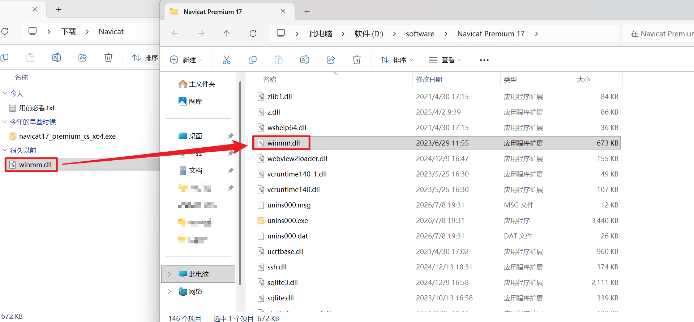

# 各类软件破解教程

# 声明
- 本页面所提供的软件逆向、加密绕过相关文件、教程、补丁，仅用于计算机安全、软件加密技术学术研究，仅限持有软件正版授权的个人，用于学习软件安全防护原理，禁止一切商用、公开分发、长期盗版使用行为。

- 所有软件版权、知识产权归属对应官方开发公司，本分享者未持有任何软件著作权授权，不提供软件合法使用许可。

- 下载者必须满足前置条件：已自行购买对应软件官方正版授权；仅在个人本地设备完成技术学习，24小时内彻底删除全部相关破解文件，不得留存、转发、二次分发本资源。

- 风险告知：破解程序普遍携带木马、后门、病毒，下载、运行造成的设备损坏、数据泄露、账号被盗等全部损失，由下载者自行承担，分享方不承担任何赔偿责任。

- 法律告知：若您无正版授权、意图长期免费使用付费软件，请立即关闭本页面，前往软件官方渠道购买正版；任何私自传播、商用破解资源的行为，将自行承担民事赔偿、行政罚款乃至刑事法律责任。

- 移除条款：软件著作权方若出示有效权属证明要求下架相关资源，本人将在24小时内彻底删除全部分享内容。

- 若您无法接受以上全部条款，请立刻退出页面，禁止下载任何文件。

---

## Typora

简介

> 此方法仅适用于1.9.5及以下版本
>
> 压缩包中已附有1.9.5安装包一个 
>
> 也可自行官网下载    [Typora](https://typora.io/)
>
> 如果条件允许    请支持官方正版

使用方法

1. 下载压缩包：[下载](8.137.172.20/crack/Typora.7z)

2. 解压压缩包（密码：F48h4q5o）；

3. 安装Typora；

4. 将包内`node_inject.exe`  `license-gen.exe`  两个程序放入安装目录（右键单击图标 打开文件所在位置  就是Typora的安装目录）；

5. 在上方地址栏输入`CMD` 回车 进入窗口；

6. 在窗口中输入`node_inject.exe`，回车执行；

   等待出现以下内容即可：

   ```bash
   extracting node_modules.asar
   adding hook.js
   applying patch
   packing node_modules.asar
   done!
   ```

7. 执行`license-gen.exe`程序后就会生成许可证，并将其复制；

8. 运行Typora 填写邮箱 许可证即可激活（可随便写，遵守邮箱格式即可）；

9. 若失败重新获取许可证。

图片如下：


---

## Navicat

简介

> 此方法适用于`Navicat`所有版本版本
>
> 压缩包中已附有`Navicat17`安装包一个 
>
> 也可自行官网下载    [Navicat](https://www.navicat.com.cn/download/navicat-premium)
>
> 如果条件允许    请支持官方正版

使用方法

1. 下载压缩包：[下载](8.137.172.20/crack/Navicat.7z)

2. 解压压缩包（密码：G6djk85vl）；

3. 安装`Navicat`；

4. 将包内的`winmm.dll`文件放到安装目录中即可。

图片如下：


