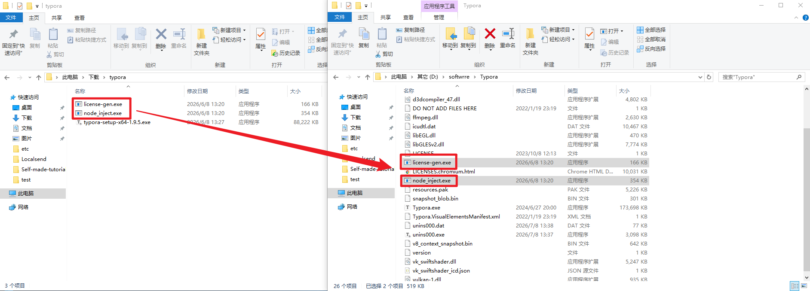
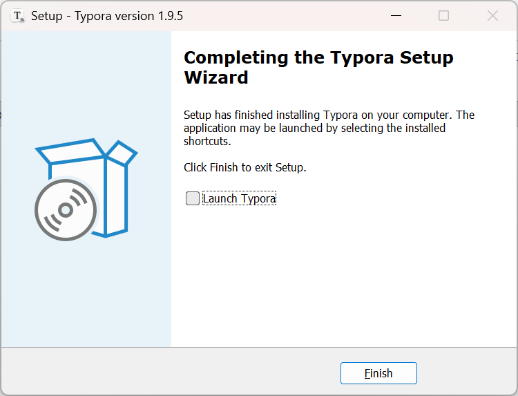
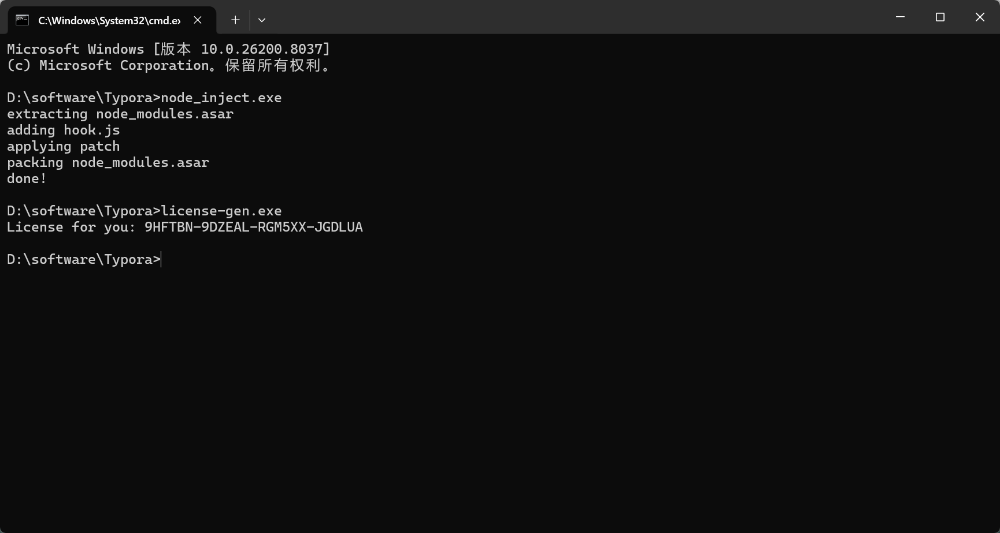
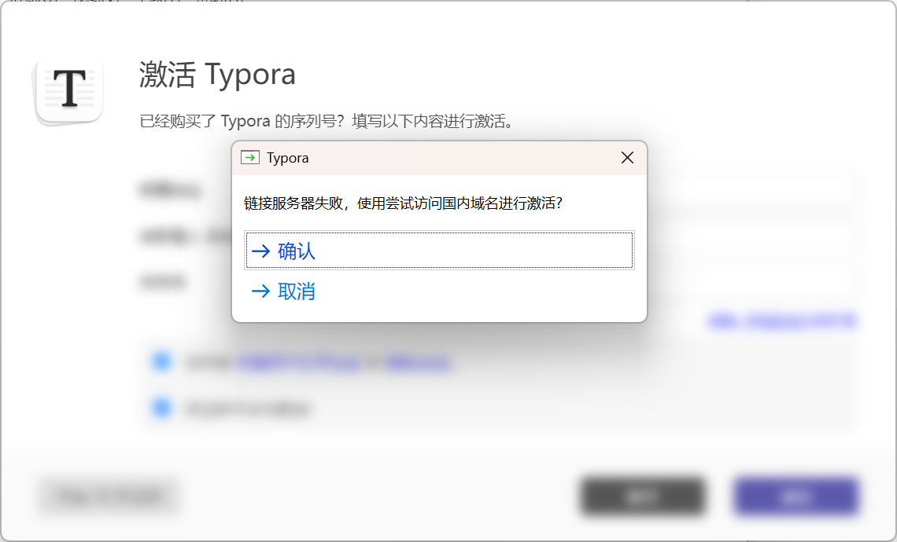

# 各类软件破解教程

---

## Typora

简介

> 此方法仅适用于1.9.5及以下版本
>
> 压缩包中已附有1.9.5安装包一个 
>
> 也可自行官网下载    [Typora](https://typora.io/)
>
> 如果条件允许    请支持官方正版

使用方法

1. 下载压缩包：

2. 解压压缩包（密码：F48h4q5o）；

3. 安装Typora；

4. 将包内`node_inject.exe`  `license-gen.exe`  两个程序放入安装目录（右键单击图标 打开文件所在位置  就是Typora的安装目录）；

5. 在上方地址栏输入`CMD` 回车 进入窗口；

6. 在窗口中输入`node_inject.exe`，回车执行；

   等待出现以下内容即可：

   ```bash
   extracting node_modules.asar
   adding hook.js
   applying patch
   packing node_modules.asar
   done!
   ```

7. 执行`license-gen.exe`程序后就会生成许可证，并将其复制；

8. 运行Typora 填写邮箱 许可证即可激活（可随便写，遵守邮箱格式即可）；

9. 若失败重新获取许可证。

图片如下：










---

## Pycharm

